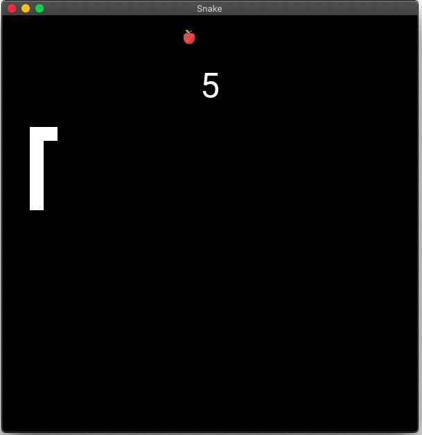

# Snake

## Description
A basic snake game. I made it to use Kivy.

## IDE, language and libraries

### IDE
PyCharm 2020.2.3 (Community Edition)

### Language
Python 3.8.6

### Library
Kivy 1.11.1

## Run the program
With the IDE or :
`python3 main.py`

Don't forget to install the library: `https://kivy.org/doc/stable/gettingstarted/installation.html`

## Credits
Apple icon  made by Vectors Market from flaticon

